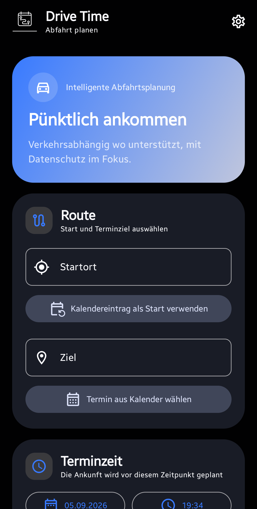
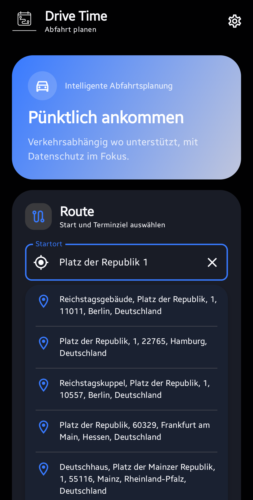
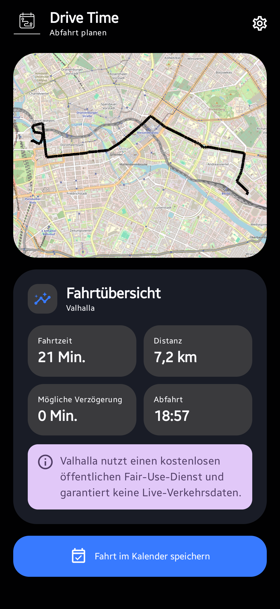
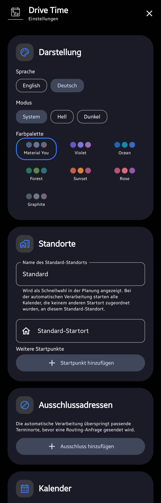
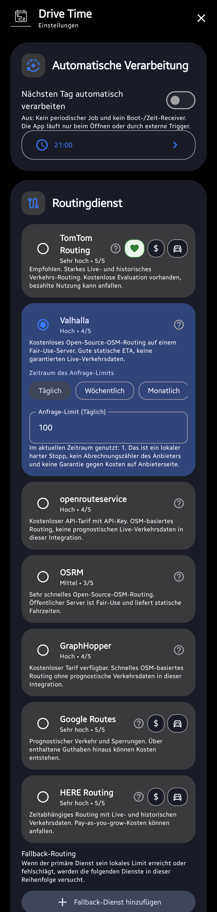

<p align="center">
  
</p>

# Drive Time Notifier

[English documentation](README_EN.md)

Drive Time Notifier ist eine native Android-App zur manuellen und automatischen Planung von Autofahrten zu Kalenderterminen. Die App berechnet eine passende Abfahrtszeit, berücksichtigt Puffer und vorherige Termine und kann die Fahrt direkt in einen Android-Kalender eintragen oder als ICS-Datei exportieren.

## Screenshots

<p align="center">
  
  
  
</p>
<p align="center">
  
  
</p>

## Funktionsumfang

- manuelle Fahrtplanung
- Android-Kalender als Quelle und Ziel
- Kalendertermin als Start- oder Zielpunkt
- benannter Standard-Startort
- zusätzliche gespeicherte Startorte
- kalenderabhängige Startorte für automatische Verarbeitung
- frei konfigurierbarer Ankunftspuffer und Erinnerung
- TomTom, Valhalla, openrouteservice, OSRM, GraphHopper, Google Routes und HERE Routing v8
- geordnete Fallback-Routinganbieter
- lokale tägliche, wöchentliche und monatliche Request-Caps
- einzelne API-/Endpoint-Selbsttests mit Statusanzeige
- Verkehrsdaten, soweit vom Provider unterstützt
- Photon für Adresssuche und Geocoding
- optionale Parkplätze und Blitzer aus OpenStreetMap/Overpass
- direkte Kalenderausgabe oder ICS speichern/teilen
- automatische Verarbeitung des nächsten Tages
- Retry- und Fehlerbenachrichtigungen
- Ausschlussregeln inklusive regulärer Ausdrücke
- Tasker-, MacroDroid- und externe Broadcast-Trigger
- App-Shortcuts
- verschlüsselter, passwortgeschützter Gerätewechsel-Export/-Import
- Deutsch und Englisch
- Light, Dark und System
- Material You und mehrere Farbpaletten

## Datenschutz

Die App betreibt keinen eigenen Backend-Server.

Kalendername, Kalenderkonto, Termintitel und Terminbeschreibung werden nicht an Routingserver übertragen. Für externe Berechnungen werden nur die für die jeweilige Funktion benötigten Orts-, Zeit- und Routendaten verwendet.

Je nach aktivierter Funktion können übertragen werden:

- Start- und Zieladresse an Photon zur Geocodierung
- Koordinaten und benötigte Zeitinformationen an den gewählten Routinganbieter
- ein geografischer Routenausschnitt an Overpass für optionale POI-Abfragen

API-Selbsttests verwenden ausschließlich feste Testkoordinaten und keine Kalender- oder gespeicherten Adressdaten.

API-Keys werden lokal mit Android-Keystore-gestützter Verschlüsselung gespeichert. Das Repository enthält keine eingebetteten Provider-Schlüssel oder persönliche Konfigurationsdaten.

## Standorte und Kalender

Der Standard-Startort besteht aus einem Friendly Name und einer Adresse und erscheint als Schnellwahl in der Planung. Bei automatischer Verarbeitung starten alle ausgewählten Quellkalender, die keinem anderen Startort zugeordnet wurden, an diesem Standard-Startort.

Zusätzliche gespeicherte Startorte können einzelnen Quellkalendern zugeordnet werden. Ziel- und Quellkalender werden über Android `CalendarContract` ausgewählt. Die Zielkalender-Auswahl ist für lange Kalenderlisten scrollbar.

Standardtitel für erzeugte Fahrt-Termine:

- Deutsch: `Deine Fahrt beginnt`
- Englisch: `Your drive starts`

Ein eigener Titel kann in den Einstellungen gesetzt werden.

## Ausschlussregeln

Die automatische Verarbeitung kann Termine vor jeder Routinganfrage anhand des Terminorts überspringen.

Unterstützt werden:

- exakter Text
- Text ohne Beachtung der Groß-/Kleinschreibung
- beliebiger Web-Link
- beliebige Telefonnummer
- regulärer Ausdruck

Regex-Regeln werden vor dem Speichern validiert.

## Automatische Verarbeitung

Die Automatik ist standardmäßig deaktiviert. Nur wenn sie aktiviert wurde, plant die App periodische Hintergrundarbeit.

Wenn sie deaktiviert ist, läuft die Verarbeitung nur:

- manuell in der App
- über App-Shortcuts
- über autorisierte externe Trigger

Automatische Routinganfragen verwenden längere Timeouts. Nach einem Fehler erfolgt ein zweiter Versuch. Schlägt auch dieser fehl, bietet eine Benachrichtigung **Fahrt öffnen** und **Wiederholen** an.

## Routinganbieter und Zugangsdaten

| Anbieter | Verkehr | Zugangsdaten |
| --- | --- | --- |
| TomTom | Live- und historische Verkehrsdaten | API-Key |
| Valhalla | OSM-Routing | kein Key am voreingestellten öffentlichen Endpoint |
| openrouteservice | OSM-Routing | API-Key |
| OSRM | OSM-Routing | kein Key am voreingestellten öffentlichen Endpoint |
| GraphHopper | OSM-Routing | API-Key |
| Google Routes | verkehrsbewusst | API-Key mit aktivierter Routes API |
| HERE Routing v8 | verkehrsbewusst | API-Key, keine App ID erforderlich |

HERE Routing v8 verwendet ausschließlich `apiKey`. Eine HERE App ID wird von dieser App weder benötigt noch übertragen.

## API- und Endpoint-Selbsttests

Jeder Provider kann einzeln direkt beim API-Key- oder Endpoint-Feld geprüft werden. Eine manuelle Fahrt ist dafür nicht erforderlich.

Status:

- graues Fragezeichen: ungeprüft
- rotes Ausrufezeichen: Prüfung fehlgeschlagen
- grüner Haken: Endpoint erreichbar und Zugangsdaten akzeptiert

Bei einem bereits grünen Status fragt die App vor einer erneuten Prüfung nach Bestätigung.

Jeder Test, der tatsächlich eine Provider-Anfrage sendet, erhöht den lokalen Request-Counter um eine Anfrage und kann zusätzlich beim Online-Kontingent des Providers zählen. Fehlender API-Key oder bereits erreichtes lokales Cap erzeugen keine externe Anfrage.

Photon wird separat geprüft und zählt nicht gegen die Routing-Caps.

## Request-Caps

Voreinstellungen:

- Valhalla: konservatives lokales Fair-Use-Limit
- openrouteservice: 2.000/Tag
- OSRM: konservatives lokales Fair-Use-Limit
- GraphHopper: 500/Tag
- Google Routes: 5.000/Monat
- HERE: 1.000/Tag
- TomTom: 2.500/Tag

Alle Werte und Zeiträume bleiben editierbar. Lokale Caps sind ein Schutzmechanismus, kein Provider-Abrechnungszähler und keine Garantie gegen Kosten.

## Fallback-Routing

Unter dem primären Provider kann eine geordnete Fallback-Liste konfiguriert werden. Provider ohne erforderlichen API-Key werden übersprungen. Der primäre Provider wird nicht zusätzlich in der Fallback-Liste geführt.

Die Übersicht verwendet kompakte monochrome Provider-Marken, soweit ein passendes Asset vorliegt. Sonst wird das allgemeine Routing-Symbol verwendet.

## Gerätewechsel und Backup

Die App kann Einstellungen und gespeicherte Provider-API-Keys in eine passwortgeschützte Datei exportieren und auf einem anderen Gerät wieder importieren.

Technisch verwendet das Backup AES-GCM mit PBKDF2-HMAC-SHA256. Das Passwort muss mindestens 8 Zeichen lang sein.

Bewusst nicht übertragen werden:

- Automatisierungs-Token
- lokale Request-Zähler
- API-/Endpoint-Teststatus

Kalender-IDs können zwischen Geräten abweichen. Nach einem Import sollten Quell- und Zielkalender deshalb geprüft werden.

## Automatisierungs-Schnittstellen

Externe Broadcasts benötigen ein pro Installation erzeugtes kryptografisch zufälliges 256-Bit-Token. Der Token kann kopiert und nach Bestätigung rotiert werden. Beim Rotieren wird der alte Token sofort ungültig.

### Morgige Fahrten verarbeiten

```text
Action: de.drivetime.notifier.ACTION_PROCESS_NEXT_DAY
Package: de.drivetime.notifier
token=<TOKEN>
```

### Einzelne Fahrt verarbeiten

```text
Action: de.drivetime.notifier.ACTION_PROCESS_EVENT
Package: de.drivetime.notifier

token=<TOKEN>
mode=process
origin=<STARTADRESSE>
destination=<ZIELADRESSE>
arrival_millis=<UNIXZEIT_MILLISEKUNDEN>
previous_end_millis=<OPTIONAL>
```

## Build

Voraussetzungen:

- JDK 17
- Android SDK 35
- Gradle 8.9

Vollständige Prüfung:

```text
gradle clean test lint assembleDebug assembleRelease
```

## Lizenz

MIT, siehe [LICENSE](LICENSE).

Drittanbieter-Hinweise: [THIRD_PARTY_NOTICES.md](THIRD_PARTY_NOTICES.md)

## Haftungsausschluss

Die App wird **AS IS** bereitgestellt. Es gibt keine Garantie für Routen, Fahrzeiten, Verkehrsdaten, Blitzerinformationen, Parkplätze, Kalenderdaten oder die dauerhafte Verfügbarkeit externer APIs. Nutzer bleiben für Provider-Verträge, API-Nutzung und entstehende Kosten verantwortlich.
