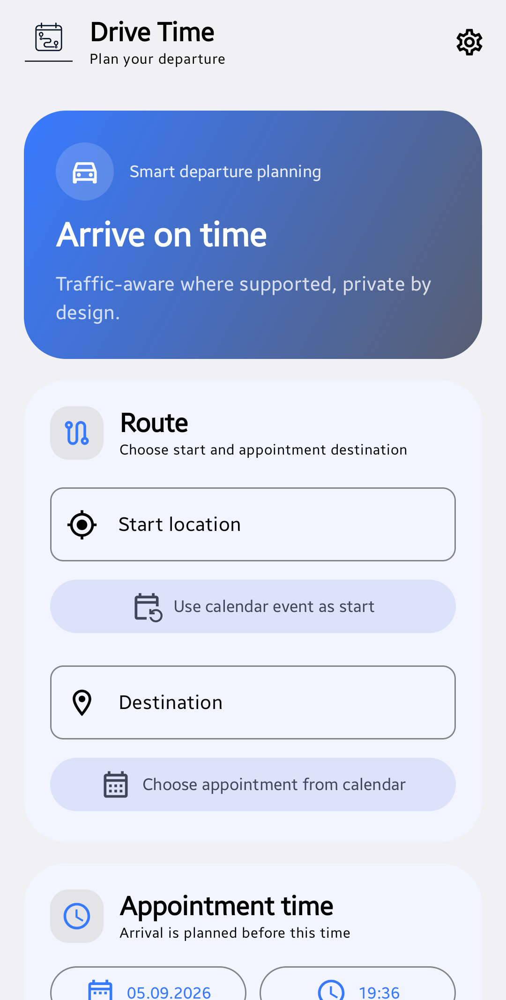
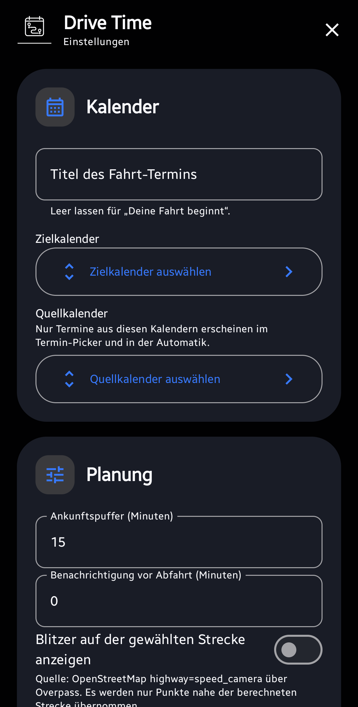
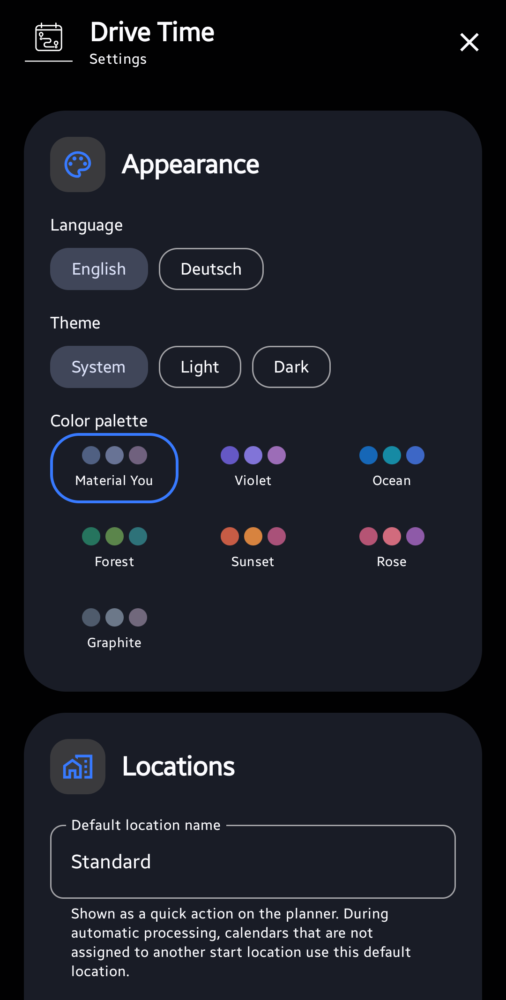

<p align="center">
  
</p>

# Drive Time Notifier

[Deutsche Dokumentation](README.md)

Drive Time Notifier is a native Android app for manually and automatically planning drives to calendar appointments. It calculates a suitable departure time, considers buffers and previous appointments, and can save the drive directly to an Android calendar or export it as an ICS file.

## Screenshots

<p align="center">
  
  
  
</p>
<p align="center">
  
</p>

## Features

- manual drive planning
- Android calendars as source and target
- calendar appointment as start or destination
- named default start location
- additional saved start locations
- per-calendar start locations for automatic processing
- configurable arrival buffer, dynamic extra buffer and reminder
- conflict checks and controlled saving despite a duplicate warning
- TomTom, Valhalla, openrouteservice, OSRM, GraphHopper, Google Routes and HERE Routing v8
- ordered fallback routing providers
- local daily, weekly and monthly request caps
- individual API and endpoint self-tests with status indicators
- traffic data where supported by the provider
- Photon address search and geocoding
- progressive map enrichment after the route calculation
- configurable parking and public charging stations from OpenStreetMap/Overpass
- optional charging-station enrichment from the German Federal Network Agency register
- parking and charging details with copyable addresses
- multiple ordered Overpass endpoints and distributable POI requests
- direct calendar output or ICS save/share
- automatic next-day processing
- retry and error notifications
- exclusion rules including regular expressions
- Tasker, MacroDroid and external broadcast triggers
- launcher shortcuts
- encrypted password-protected settings/API-key backup for device migration
- integrated update check through GitHub Releases
- copyable network diagnostics for support and troubleshooting
- English and German
- light, dark and system appearance
- Material You and multiple color palettes

## Privacy

The app operates no backend server of its own.

Calendar name, calendar account, appointment title and appointment description are not sent to routing servers. Only location, timing and routing data required for the selected external function is transmitted.

Depending on enabled features, the app may send:

- start and destination addresses to Photon for geocoding
- coordinates and required timing data to the selected routing provider
- a geographic route area to Overpass for optional POI enrichment

API self-tests use fixed test coordinates only and no calendar or saved-address data.

API keys are stored locally using Android Keystore-backed encryption. The repository contains no embedded provider credentials or personal configuration data.

## Locations and calendars

The default start location has a friendly name and address and appears as a quick action in the planner. During automatic processing, every selected source calendar that is not assigned to another start location uses this default location.

Additional saved locations can be assigned to individual source calendars. Source and target calendars are selected through Android `CalendarContract`. The target-calendar picker is scrollable for long calendar lists.

Default generated drive-event titles:

- English: `Your drive starts`
- German: `Deine Fahrt beginnt`

A custom title can be configured in Settings.

## Exclusion rules

Automatic processing can skip appointments by location before any routing request is sent.

Supported rules:

- exact text
- text ignoring case
- any web link
- any phone number
- regular expression

Regex rules are validated before saving.

## Automatic processing

Automatic processing is disabled by default. Periodic background work is scheduled only when the user enables it.

When disabled, processing runs only:

- manually in the app
- through launcher shortcuts
- through authorized external triggers

Automatic routing uses longer timeouts. A failed calculation is retried once. If the second attempt fails, a notification offers **Open drive** and **Retry**.

## Routing providers and credentials

| Provider | Traffic | Credentials |
| --- | --- | --- |
| TomTom | live and historical traffic | API key |
| Valhalla | OSM routing | no key for the preset public endpoint |
| openrouteservice | OSM routing | API key |
| OSRM | OSM routing | no key for the preset public endpoint |
| GraphHopper | OSM routing | API key |
| Google Routes | traffic-aware | API key with Routes API enabled |
| HERE Routing v8 | traffic-aware | API key, no App ID required |

HERE Routing v8 uses `apiKey` only. A HERE App ID is neither required nor transmitted by this app.

## API and endpoint self-tests

Every provider can be checked individually next to its API-key or endpoint field. No manual drive is required.

Status:

- gray question mark: not checked
- red exclamation mark: check failed
- green check mark: endpoint reachable and credentials accepted

If the status is already green, the app asks for confirmation before sending another test request. Photon and Overpass are tested directly inside their shared network settings dialog.

Every provider test that actually sends a request increments the local request counter by one and may also count against the provider's online quota. A missing API key or already reached local cap causes no external request.

Photon is tested separately and does not count against routing caps.

## Request caps

Defaults:

- Valhalla: conservative local fair-use cap
- openrouteservice: 2,000/day
- OSRM: conservative local fair-use cap
- GraphHopper: 500/day
- Google Routes: 5,000/month
- HERE: 1,000/day
- TomTom: 2,500/day

All limits and periods remain editable. Local caps are a safety mechanism, not a provider billing meter and not a guarantee against charges.

## Fallback routing

An ordered fallback list can be configured below the primary provider. Providers missing a required API key are skipped. The primary provider is not duplicated in the fallback list.

The overview uses compact monochrome provider marks where a suitable asset is available, otherwise it falls back to the generic routing icon.

## Dynamic buffer

In addition to the fixed arrival buffer, the app can apply a dynamic extra buffer based on the calculated drive duration. The result shows the included buffer directly. Calendar entries display it in parentheses next to the drive duration.

## Parking and charging stations

The calculated route and map appear first. Selected supplementary data loads independently afterwards. The result screen shows each request's state, offers an individual retry and allows the drive to be saved without supplementary data.

Parking search supports a configurable result count, 10 by default, a destination radius and a free-only filter. Markers distinguish known free, paid and unknown-fee parking. Search includes OpenStreetMap nodes, areas and relations.

Charging search supports a configurable result count, 5 by default, a destination radius, minimum charging power, operator filtering and multiple desired connector types. The app can optionally merge public register data from Germany's Federal Network Agency. A selected charger can become a route waypoint, with the remaining distance linked as a walking route.

Detail views expose available OpenStreetMap and register fields, including address, operator, network, connectors, charging power, opening hours, fees, capacity, access, source and distance. Addresses and other values are selectable. Addresses also have a dedicated copy action. The app does not claim guaranteed live availability.

## Photon and Overpass

Photon and Overpass settings share one dialog. Photon accepts a custom HTTPS endpoint. Multiple Overpass HTTPS endpoints can be entered, ordered, enabled and tested individually. Presets include openly accessible global instances and clearly marked services that may require credentials or a contract.

POI requests can be distributed across active Overpass instances or sent through the same ordered fallback chain. The app handles overloads, timeouts and HTTP 429 responses with bounded attempts, endpoint switching and cooldowns. Search radius, result count, runtime and response size are limited. Downloaded data is parsed only as structured POI data and is never executed as code.

## Diagnostics and updates

Five taps on `Vibecoded with ❤️` open network diagnostics below the automation interfaces. The open state persists while navigating away from Settings. The scrollable, copyable report contains only diagnostic configuration, services, response times, outcomes and truncated error responses. The panel can be closed again.

The integrated update check compares the installed version with public GitHub Releases. Updates are never installed without user approval.

## Device migration and backup

Settings and saved provider API keys can be exported to a password-protected file and imported on another device.

The backup uses AES-GCM with PBKDF2-HMAC-SHA256. The password must contain at least 8 characters.

The following remain device-specific and are intentionally not transferred:

- automation token
- local request counters
- API/endpoint test states

Calendar IDs can differ between devices. Review source and target calendars after importing.

## Automation interfaces

External broadcasts require a cryptographically random 256-bit token generated per installation. The token can be copied and rotated after confirmation. Rotation immediately invalidates the old token.

### Process tomorrow's drives

```text
Action: de.drivetime.notifier.ACTION_PROCESS_NEXT_DAY
Package: de.drivetime.notifier
token=<TOKEN>
```

### Process one drive

```text
Action: de.drivetime.notifier.ACTION_PROCESS_EVENT
Package: de.drivetime.notifier

token=<TOKEN>
mode=process
origin=<START_ADDRESS>
destination=<DESTINATION_ADDRESS>
arrival_millis=<UNIX_TIME_MILLISECONDS>
previous_end_millis=<OPTIONAL>
```

## Build

Requirements:

- JDK 17
- Android SDK 35
- Gradle 8.9

Full verification:

```text
gradle clean test lint assembleDebug assembleRelease
```

## License

MIT, see [LICENSE](LICENSE).

Third-party notices: [THIRD_PARTY_NOTICES.md](THIRD_PARTY_NOTICES.md)

## Disclaimer

The app is provided **AS IS**. There is no warranty for routes, travel times, traffic information, parking data, charging-station or register data, calendar data or long-term availability of external APIs. Users remain responsible for provider contracts, API usage and charges.
